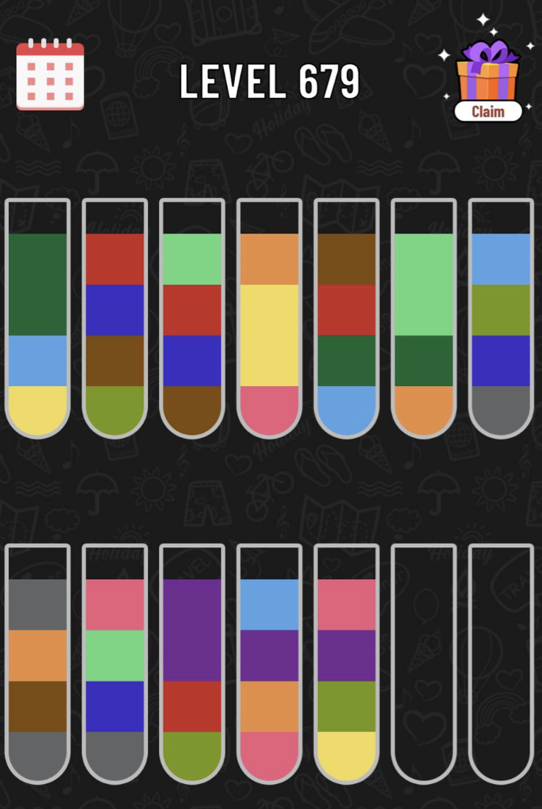
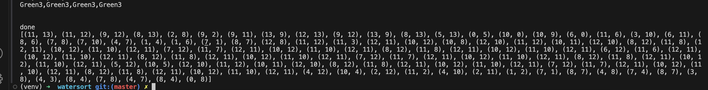

# Water sort solver 

### Backend 

- Attempt to build a backend engine using Django framework for

1. Having an engine that return a solver includes multiple steps of pouring water from 1 glass to another. 

Here is a sample plan for the configuration above

2. Allow the user to CRUD the new game as well as its solver for the user to retrieve the history later. 

### Frontend 
- Attempt to build a frontend using React framework written in JS. 
- The user could create a new game, run a solver, save a game solver and delete the game etc. 
