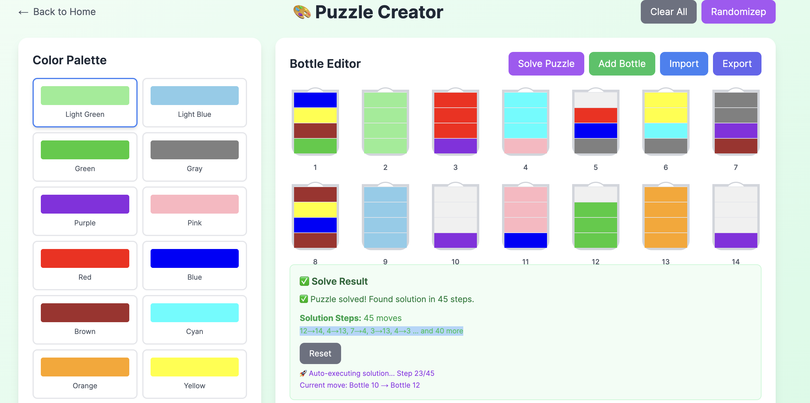

# 🧪 Water Sort Solver

A beautiful, interactive Water Sort puzzle game with AI-powered solving capabilities. Built with Next.js frontend and Django backend.

## ✨ Features

- **🎮 Interactive Gameplay**: Click to select bottles and pour water between them
- **🤖 AI Solver**: Get optimal solutions using advanced algorithms
- **🎨 Puzzle Creator**: Design your own custom puzzles
- **📱 Responsive Design**: Works perfectly on desktop and mobile
- **🎯 Step-by-Step Solutions**: Watch the AI solve puzzles step by step
- **💾 Import/Export**: Save and share your custom puzzles

## 🚀 Quick Start

### Option 1: One-Command Setup
```bash
./start-dev.sh
```

### Option 2: Manual Setup

#### Backend Setup
```bash
cd backend/backend
source ../venv/bin/activate
pip install -r ../requirements.txt
python manage.py runserver 8000
```

#### Frontend Setup
```bash
cd frontend
npm install
npm run dev
```

## 🎯 How to Play

1. **Start Playing**: Click "Play Game" to begin with a pre-made puzzle
2. **Select Bottles**: Click on a bottle to select it (highlighted in yellow)
3. **Pour Water**: Click on another bottle to pour water from selected to target
4. **Rules**: 
   - You can only pour water of the same color on top of each other
   - Goal: Sort all waters so each bottle contains only one color
   - Use empty bottles strategically
5. **Get Help**: Click "Solve" to get the optimal solution
6. **Watch Solution**: Use "Play Solution" to see the AI solve it step by step

## 🎨 Puzzle Creator

1. **Create Custom Puzzles**: Click "Create Puzzle" to design your own
2. **Choose Colors**: Select from 12 beautiful colors
3. **Arrange Bottles**: Click on bottles to add/remove water
4. **Set Capacity**: Adjust bottle capacity (3-6 units)
5. **Export/Import**: Save your puzzles as JSON files
6. **Randomize**: Generate random solvable puzzles

## 🏗️ Architecture

### Frontend (Next.js + TypeScript)
- **React Components**: Modular, reusable UI components
- **Tailwind CSS**: Beautiful, responsive styling
- **TypeScript**: Type-safe development
- **State Management**: React hooks for game state

### Backend (Django + Python)
- **REST API**: Clean API endpoints for puzzle solving
- **Algorithm**: Advanced BFS-based solver with optimization
- **CORS Support**: Cross-origin requests enabled
- **Error Handling**: Comprehensive error responses

## 🔧 API Endpoints

### Solve Puzzle
```http
POST /api/solve/
Content-Type: application/json

{
  "bottles": [
    {
      "capacity": 4,
      "waters": ["Red", "Blue", "Green", "Yellow"]
    }
  ]
}
```

**Response:**
```json
{
  "plan": [[0, 1], [2, 3]],
  "steps": 2,
  "success": true
}
```

## 🎨 Color System

The game supports 12 distinct colors:
- **XanhLaNhat** (Light Green) - #90EE90
- **XanhBlueNhat** (Light Blue) - #87CEEB
- **XanhLa** (Green) - #32CD32
- **Xam** (Gray) - #808080
- **Tim** (Purple) - #8A2BE2
- **Hong** (Pink) - #FFB6C1
- **Do** (Red) - #FF0000
- **XanhBlue** (Blue) - #0000FF
- **Nau** (Brown) - #A52A2A
- **XanhCyan** (Cyan) - #00FFFF
- **Cam** (Orange) - #FFA500
- **Vang** (Yellow) - #FFFF00

## 🧠 Algorithm Details

The solver uses a **Breadth-First Search (BFS)** approach with optimizations:

1. **State Representation**: Each game state is represented as a hashable object
2. **BFS Traversal**: Explores all possible moves level by level
3. **Dead State Detection**: Identifies and skips impossible states
4. **Path Reconstruction**: Backtracks to find the optimal solution
5. **Timeout Protection**: Prevents infinite loops with 30-second timeout

## 🛠️ Development

### Project Structure
```
WaterSortSolver/
├── frontend/                 # Next.js frontend
│   ├── src/app/             # App components
│   │   ├── page.tsx         # Home page
│   │   ├── game.tsx         # Game interface
│   │   └── puzzle-creator.tsx # Puzzle creator
│   └── package.json
├── backend/                 # Django backend
│   ├── backend/
│   │   ├── watersort/       # Main app
│   │   │   ├── solver.py    # Core algorithm
│   │   │   ├── views.py     # API endpoints
│   │   │   └── urls.py      # URL routing
│   │   └── settings.py      # Django settings
│   └── requirements.txt
└── start-dev.sh            # Development script
```

### Adding New Features

1. **Frontend**: Add new components in `frontend/src/app/`
2. **Backend**: Add new endpoints in `backend/backend/watersort/views.py`
3. **Styling**: Use Tailwind CSS classes for consistent design
4. **API**: Follow RESTful conventions for new endpoints

## 🐛 Troubleshooting

### Common Issues

1. **CORS Errors**: Ensure backend is running on port 8000
2. **API Timeout**: Complex puzzles may take up to 30 seconds
3. **Import Errors**: Make sure all dependencies are installed
4. **Port Conflicts**: Change ports in package.json and settings.py

### Debug Mode
- Frontend: `npm run dev` with browser dev tools
- Backend: `python manage.py runserver 8000 --verbosity=2`

## 📄 License

This project is open source and available under the MIT License.

## 🤝 Contributing

1. Fork the repository
2. Create a feature branch
3. Make your changes
4. Add tests if applicable
5. Submit a pull request

## 🙏 Acknowledgments

- Inspired by the popular Water Sort Puzzle mobile game
- Built with modern web technologies
- Algorithm optimized for performance and accuracy

---

**Happy Sorting! 🧪✨**